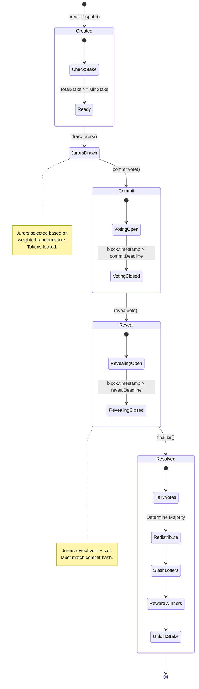

# SimpleKleros Dispute Flow

```mermaid
stateDiagram-v2
    [*] --> Created: createDispute()
    
    state Created {
        [*] --> CheckStake
        CheckStake --> Ready: TotalStake >= MinStake
    }

    Created --> JurorsDrawn: drawJurors()
    
    note right of JurorsDrawn
        Jurors selected based on
        weighted random stake.
        Tokens locked.
    end note

    JurorsDrawn --> Commit: commitVote()
    
    state Commit {
        [*] --> VotingOpen
        VotingOpen --> VotingClosed: block.timestamp > commitDeadline
    }

    Commit --> Reveal: revealVote()
    
    note right of Reveal
        Jurors reveal vote + salt.
        Must match commit hash.
    end note

    state Reveal {
        [*] --> RevealingOpen
        RevealingOpen --> RevealingClosed: block.timestamp > revealDeadline
    }

    Reveal --> Resolved: finalize()
    
    state Resolved {
        [*] --> TallyVotes
        TallyVotes --> Redistribute: Determine Majority
        Redistribute --> SlashLosers
        SlashLosers --> RewardWinners
        RewardWinners --> UnlockStake
    }

    Resolved --> [*]
```
